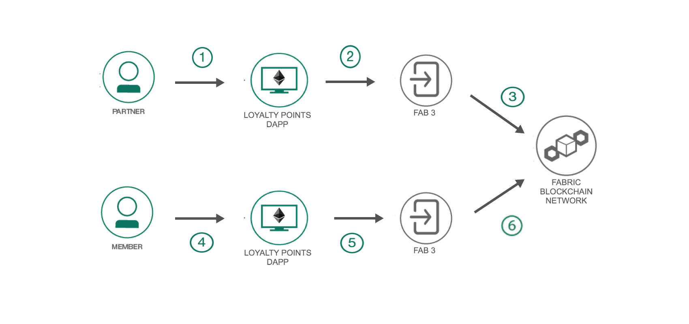
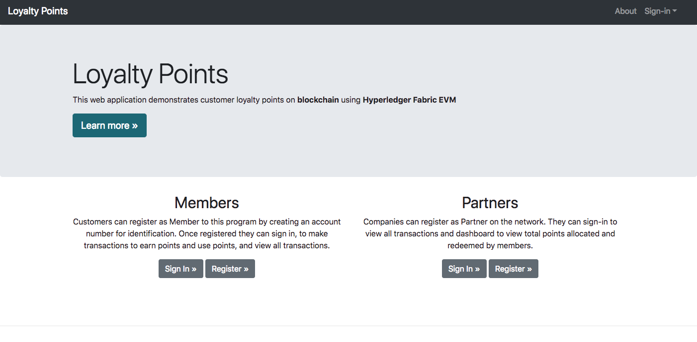

# Loyalty Points with Fabric EVM

This code pattern illustrates the Hyperledger Fabric EVM plugin which allows developers to create  blockchain application with EVM (Ethereum Virtual Machine) smart contract languages such as Solidity. This smart contract is deployed onto the EVM chaincode running on the Fabric peers. This pattern shows how a user, such as a member or partner for our loyalty points use case, can interact with the smart contract through a fab proxy.  This proxy allows for using the Ethereum web3.js library for interacting with the smart contract which is incorporated in the web application.  

A Node.js web application demonstrates a loyalty points contract by allowing users to register as members or partners on the network. The members can then sign-in and perform transactions to earn or redeem points with the partners on the network. All the transactions are stored by the smart contract and displayed to the members and partners accessing the application.

This code pattern is for developers looking to create blockchain applications with Hyperledger Fabric EVM incorporating Solidity smart contract and web3.js library. When the reader has completed this code pattern, they will understand how to:

* Deploy an instance of Hyperledger Fabric locally with EVM chaincode
* Start a Fabric proxy to interact with the smart contract
* Interact with the Solidity smart contract through web3 library
* Build a Node.js blockchain web application with web3 library


# Architecture Flow

<p align="center">
  
</p>

**Note** The blockchain network can have multiple members and partners

1. Partner would use a fab proxy for their account to access the blockchain network. The initial partner would deploy the smart contract to the blockchain network.
2. Partner accesses the web application through their proxy, to register on the network and view all transactions.
3. Member would use a fab proxy for their account to access the blockchain network
4. Member accesses the web application through their proxy, to register on the network, perform transactions to earn or redeem points from the partners on the network, and view all transactions.
5. The web application uses the ethereum web3.js library to execute smart contract
6. The smart contract executions are updated on the network with the EVM chaincode installed on the peers

# Included Components

* [Hyperledger Fabric v1.3](https://hyperledger.github.io/composer/latest/) Hyperledger Fabric is a platform for distributed ledger solutions, underpinned by a modular architecture delivering high degrees of confidentiality, resiliency, flexibility and scalability
* [Hyperledger Fabric EVM chaincode plugin](https://github.com/hyperledger/fabric-chaincode-evm) This project enables one to use the Hyperledger Fabric permissioned blockchain platform to interact with Ethereum smart contracts written in an EVM compatible language such as Solidity or Vyper.
* [Ethereum web3.js](https://web3js.readthedocs.io/en/1.0/) web3.js is a collection of libraries which allow you to interact with a local or remote ethereum node, using a HTTP or IPC connection.
* [Solidity](https://solidity.readthedocs.io/en/v0.4.25/) Solidity is a contract-oriented, high-level language for implementing smart contracts

## Featured technology
+ [Nodejs](https://www.python.org/) Node.js is an open-source, cross-platform JavaScript run-time environment that executes JavaScript code server-side
+ [Bootstrap](https://getbootstrap.com/) Bootstrap is an open source toolkit for developing with HTML, CSS, and JS


# Running the Application

## Prerequisite
- [Go](https://golang.org/dl/) (version 1.11.1)
- [Docker](https://www.docker.com/) (version 17.06.2-ce or greater)
- [Node](https://nodejs.org/en/) (version 8.9.x or greater)
- [npm](https://www.npmjs.com/) (version 5.6.0)

## Steps

1. [Deploy Hyperledger Fabric locally with EVM chaincode](#1-deploy-hyperledger-fabric-locally-with-evm)
    - [Clean docker and set GOPATH](#clean-docker-and-set-gopath)
    - [Get Fabric Samples and download Fabric images](#get-fabric-samples-and-download-fabric-images)
    - [Mount the EVM Chaincode and start the network](#mount-the-evm-chaincode-and-start-the-network)
    - [Install and Instantiate EVM Chaincode](#install-and-instantiate-evm-chaincode)
2. [Setup fab proxy](#2-setup-fab-proxy-and-deploy-the-contract)
3. [Deploy the smart contract](#3-deploy-the-smart-contract)
4. [Setup second fab proxy](#4-setup-second-fab-proxy)
5. [Run the web application](#5-run-the-web-application)


## 1. Deploy Hyperledger Fabric locally with EVM chaincode

In this step, we will setup fabric locally using docker containers, and install and instantiate the evm chaincode on our fabric peers. This step uses the hyperledger [fabric-sample](https://github.com/hyperledger/fabric-samples) repo to deploy fabric locally and the [fabric-chaincode-evm](https://github.com/hyperledger/fabric-chaincode-evm) repo for the evm chaincode and configuration to start fab proxies for the users.  This step follows the [fabric-chaincode-evm tutorial](https://github.com/hyperledger/fabric-chaincode-evm) closely.

### Clean docker and set GOPATH

This will remove all your docker containers and images!
```
docker stop $(docker ps -a -q)
docker rm $(docker ps -a -q)
docker rmi $(docker images -q) -f
```

Make sure to set GOPATH to your go installation
```
export GOPATH=$HOME/go
```

### Get Fabric Samples and download Fabric images

Clone the [fabric-samples](https://github.com/hyperledger/fabric-samples) repo in your `GOPATH/src/github.com/hyperledger` directory:
```
cd $GOPATH/src/github.com/hyperledger/
git clone https://github.com/hyperledger/fabric-samples.git
```

Checkout `release-1.3`
```
cd fabric-samples
git checkout release-1.3
```

Download the docker images
```
./scripts/bootstrap.sh
```

### Mount the EVM Chaincode and start the network

Clone the `fabric-chaincode-evm` repo in your GOPATH directory.
```
cd $GOPATH/src/github.com/hyperledger/
git clone https://github.com/hyperledger/fabric-chaincode-evm
```

Now navigate back to your fabric-samples folder.  Here we will use first-network to launch the network.
```
cd $GOPATH/src/github.com/hyperledger/fabric-samples/first-network
```

Update the `docker-compose-cli.yaml` with the volumes to include the fabric-chaincode-evm.

```
  cli:
    volumes:
      - ./../../fabric-chaincode-evm:/opt/gopath/src/github.com/hyperledger/fabric-chaincode-evm
```

Generate certificates and bring up the network
```
./byfn.sh generate
./byfn.sh up
```

### Install and Instantiate EVM Chaincode

Navigate into the cli docker container
```
docker exec -it cli bash
```

If successful, you should see the following prompt
```
root@0d78bb69300d:/opt/gopath/src/github.com/hyperledger/fabric/peer#
```

To change which peer is targeted change the following environment variables:
```
export CORE_PEER_MSPCONFIGPATH=/opt/gopath/src/github.com/hyperledger/fabric/peer/crypto/peerOrganizations/org1.example.com/users/Admin@org1.example.com/msp
export CORE_PEER_ADDRESS=peer0.org1.example.com:7051
export CORE_PEER_LOCALMSPID="Org1MSP"
export CORE_PEER_TLS_ROOTCERT_FILE=/opt/gopath/src/github.com/hyperledger/fabric/peer/crypto/peerOrganizations/org1.example.com/peers/peer0.org1.example.com/tls/ca.crt
```

Next install the EVM chaincode on all the peers
```
peer chaincode install -n evmcc -l golang -v 0 -p github.com/hyperledger/fabric-chaincode-evm/evmcc
```

Instantiate the chaincode:

```
peer chaincode instantiate -n evmcc -v 0 -C mychannel -c '{"Args":[]}' -o orderer.example.com:7050 --tls --cafile /opt/gopath/src/github.com/hyperledger/fabric/peer/crypto/ordererOrganizations/example.com/orderers/orderer.example.com/msp/tlscacerts/tlsca.example.com-cert.pem
```


Great. You are now ready to setup fab proxy.


## 2. Setup Fab Proxy

In a terminal, execute the following to set certain environment variables required for setting the fab proxy.

```
export FABPROXY_CONFIG=${GOPATH}/src/github.com/hyperledger/fabric-chaincode-evm/examples/first-network-sdk-config.yaml # Path to a compatible Fabric SDK Go config file
export FABPROXY_USER=User1 # User identity being used for the proxy (Matches the users names in the crypto-config directory specified in the config)
export FABPROXY_ORG=Org1  # Organization of the specified user
export FABPROXY_CHANNEL=mychannel # Channel to be used for the transactions
export FABPROXY_CCID=evmcc # ID of the EVM Chaincode deployed in your fabric network
export PORT=5000 # Port the proxy will listen on. If not provided default is 5000.
```

Navigate to the `fabric-chaincode-evm` cloned repo:
```
cd $GOPATH/src/github.com/hyperledger/fabric-chaincode-evm/
```
Run the following to build the fab proxy
```
go build -o fab3 ./fabproxy/cmd
```
You can then run the proxy:
```
./fab3
```

This will start fab proxy at `http://localhost:5000`

## 3. Deploy the smart contract

Next, we'll install web3 and use this library to deploy the smart contract. In a new terminal, install web3 by running the following:
```
npm install web3@0.20.2
```

Now we'll enter node console to set up our web3.
```
node
```
Assign Web3 library and use the fab proxy as provider
```
Web3 = require('web3')
web3 = new Web3(new Web3.providers.HttpProvider('http://localhost:5000'))
```
Check to see you account information
```
web3.eth.accounts
```
You should see something like:
  ```
  [ '0x2c045d4565e31cef1f6cd7368c3436a79f1cea4f' ]
  ```
Assign this account as defaultAccount
```
web3.eth.defaultAccount = web3.eth.accounts[0]
```

Now we are ready to deploy the LoyaltyPoints contract. We will assign the contract's ABI and byte code.  These can be generated through remix (http://remix.ethereum.org)

Assign the abi of the contract:

<details>
  <summary>Assign Loyalty ABI </summary>
   <p>LoyaltyABI = [
   	{
   		"constant": true,
   		"inputs": [
   			{
   				"name": "",
   				"type": "address"
   			}
   		],
   		"name": "members",
   		"outputs": [
   			{
   				"name": "memberAddress",
   				"type": "address"
   			},
   			{
   				"name": "firstName",
   				"type": "string"
   			},
   			{
   				"name": "lastName",
   				"type": "string"
   			},
   			{
   				"name": "email",
   				"type": "string"
   			},
   			{
   				"name": "points",
   				"type": "uint256"
   			},
   			{
   				"name": "isRegistered",
   				"type": "bool"
   			}
   		],
   		"payable": false,
   		"stateMutability": "view",
   		"type": "function"
   	},
   	{
   		"constant": true,
   		"inputs": [],
   		"name": "transactionsInfoLength",
   		"outputs": [
   			{
   				"name": "",
   				"type": "uint256"
   			}
   		],
   		"payable": false,
   		"stateMutability": "view",
   		"type": "function"
   	},
   	{
   		"constant": false,
   		"inputs": [
   			{
   				"name": "_firstName",
   				"type": "string"
   			},
   			{
   				"name": "_lastName",
   				"type": "string"
   			},
   			{
   				"name": "_email",
   				"type": "string"
   			}
   		],
   		"name": "registerMember",
   		"outputs": [],
   		"payable": false,
   		"stateMutability": "nonpayable",
   		"type": "function"
   	},
   	{
   		"constant": false,
   		"inputs": [
   			{
   				"name": "_points",
   				"type": "uint256"
   			},
   			{
   				"name": "_partnerAddress",
   				"type": "address"
   			}
   		],
   		"name": "usePoints",
   		"outputs": [],
   		"payable": false,
   		"stateMutability": "nonpayable",
   		"type": "function"
   	},
   	{
   		"constant": false,
   		"inputs": [
   			{
   				"name": "_points",
   				"type": "uint256"
   			},
   			{
   				"name": "_partnerAddress",
   				"type": "address"
   			}
   		],
   		"name": "earnPoints",
   		"outputs": [],
   		"payable": false,
   		"stateMutability": "nonpayable",
   		"type": "function"
   	},
   	{
   		"constant": true,
   		"inputs": [
   			{
   				"name": "",
   				"type": "uint256"
   			}
   		],
   		"name": "transactionsInfo",
   		"outputs": [
   			{
   				"name": "points",
   				"type": "uint256"
   			},
   			{
   				"name": "transactionType",
   				"type": "uint8"
   			},
   			{
   				"name": "memberAddress",
   				"type": "address"
   			},
   			{
   				"name": "partnerAddress",
   				"type": "address"
   			}
   		],
   		"payable": false,
   		"stateMutability": "view",
   		"type": "function"
   	},
   	{
   		"constant": true,
   		"inputs": [
   			{
   				"name": "",
   				"type": "address"
   			}
   		],
   		"name": "partners",
   		"outputs": [
   			{
   				"name": "partnerAddress",
   				"type": "address"
   			},
   			{
   				"name": "name",
   				"type": "string"
   			},
   			{
   				"name": "isRegistered",
   				"type": "bool"
   			}
   		],
   		"payable": false,
   		"stateMutability": "view",
   		"type": "function"
   	},
   	{
   		"constant": true,
   		"inputs": [
   			{
   				"name": "",
   				"type": "uint256"
   			}
   		],
   		"name": "partnersInfo",
   		"outputs": [
   			{
   				"name": "partnerAddress",
   				"type": "address"
   			},
   			{
   				"name": "name",
   				"type": "string"
   			},
   			{
   				"name": "isRegistered",
   				"type": "bool"
   			}
   		],
   		"payable": false,
   		"stateMutability": "view",
   		"type": "function"
   	},
   	{
   		"constant": true,
   		"inputs": [],
   		"name": "partnersInfoLength",
   		"outputs": [
   			{
   				"name": "",
   				"type": "uint256"
   			}
   		],
   		"payable": false,
   		"stateMutability": "view",
   		"type": "function"
   	},
   	{
   		"constant": false,
   		"inputs": [
   			{
   				"name": "_name",
   				"type": "string"
   			}
   		],
   		"name": "registerPartner",
   		"outputs": [],
   		"payable": false,
   		"stateMutability": "nonpayable",
   		"type": "function"
   	}
   ]</p>
</details>
<br>


Next assign the evm complied byte code:  
```
LoyaltyByteCode = `608060405234801561001057600080fd5b50611c1e806100206000396000f3006080604052600436106100a4576000357c0100000000000000000000000000000000000000000000000000000000900463ffffffff16806308ae4b0c146100a957806309b569111461028257806349c81cc5146102ad5780634d11b26b146103a257806360bd2683146103ef578063674c70991461043c57806395c33652146104f8578063d5763aea146105f2578063e6a14a7c146106d6578063e7a96e0c14610701575b600080fd5b3480156100b557600080fd5b506100ea600480360381019080803573ffffffffffffffffffffffffffffffffffffffff16906020019092919050505061076a565b604051808773ffffffffffffffffffffffffffffffffffffffff1673ffffffffffffffffffffffffffffffffffffffff16815260200180602001806020018060200186815260200185151515158152602001848103845289818151815260200191508051906020019080838360005b83811015610174578082015181840152602081019050610159565b50505050905090810190601f1680156101a15780820380516001836020036101000a031916815260200191505b50848103835288818151815260200191508051906020019080838360005b838110156101da5780820151818401526020810190506101bf565b50505050905090810190601f1680156102075780820380516001836020036101000a031916815260200191505b50848103825287818151815260200191508051906020019080838360005b83811015610240578082015181840152602081019050610225565b50505050905090810190601f16801561026d5780820380516001836020036101000a031916815260200191505b50995050505050505050505060405180910390f35b34801561028e57600080fd5b5061029761099b565b6040518082815260200191505060405180910390f35b3480156102b957600080fd5b506103a0600480360381019080803590602001908201803590602001908080601f0160208091040260200160405190810160405280939291908181526020018383808284378201915050505050509192919290803590602001908201803590602001908080601f0160208091040260200160405190810160405280939291908181526020018383808284378201915050505050509192919290803590602001908201803590602001908080601f01602080910402602001604051908101604052809392919081815260200183838082843782019150505050505091929192905050506109a8565b005b3480156103ae57600080fd5b506103ed60048036038101908080359060200190929190803573ffffffffffffffffffffffffffffffffffffffff169060200190929190505050610cd3565b005b3480156103fb57600080fd5b5061043a60048036038101908080359060200190929190803573ffffffffffffffffffffffffffffffffffffffff16906020019092919050505061114b565b005b34801561044857600080fd5b506104676004803603810190808035906020019092919050505061150b565b6040518085815260200184600181111561047d57fe5b60ff1681526020018373ffffffffffffffffffffffffffffffffffffffff1673ffffffffffffffffffffffffffffffffffffffff1681526020018273ffffffffffffffffffffffffffffffffffffffff1673ffffffffffffffffffffffffffffffffffffffff16815260200194505050505060405180910390f35b34801561050457600080fd5b50610539600480360381019080803573ffffffffffffffffffffffffffffffffffffffff169060200190929190505050611597565b604051808473ffffffffffffffffffffffffffffffffffffffff1673ffffffffffffffffffffffffffffffffffffffff1681526020018060200183151515158152602001828103825284818151815260200191508051906020019080838360005b838110156105b557808201518184015260208101905061059a565b50505050905090810190601f1680156105e25780820380516001836020036101000a031916815260200191505b5094505050505060405180910390f35b3480156105fe57600080fd5b5061061d60048036038101908080359060200190929190505050611686565b604051808473ffffffffffffffffffffffffffffffffffffffff1673ffffffffffffffffffffffffffffffffffffffff1681526020018060200183151515158152602001828103825284818151815260200191508051906020019080838360005b8381101561069957808201518184015260208101905061067e565b50505050905090810190601f1680156106c65780820380516001836020036101000a031916815260200191505b5094505050505060405180910390f35b3480156106e257600080fd5b506106eb611784565b6040518082815260200191505060405180910390f35b34801561070d57600080fd5b50610768600480360381019080803590602001908201803590602001908080601f0160208091040260200160405190810160405280939291908181526020018383808284378201915050505050509192919290505050611791565b005b60006020528060005260406000206000915090508060000160009054906101000a900473ffffffffffffffffffffffffffffffffffffffff1690806001018054600181600116156101000203166002900480601f01602080910402602001604051908101604052809291908181526020018280546001816001161561010002031660029004801561083c5780601f106108115761010080835404028352916020019161083c565b820191906000526020600020905b81548152906001019060200180831161081f57829003601f168201915b505050505090806002018054600181600116156101000203166002900480601f0160208091040260200160405190810160405280929190818152602001828054600181600116156101000203166002900480156108da5780601f106108af576101008083540402835291602001916108da565b820191906000526020600020905b8154815290600101906020018083116108bd57829003601f168201915b505050505090806003018054600181600116156101000203166002900480601f0160208091040260200160405190810160405280929190818152602001828054600181600116156101000203166002900480156109785780601f1061094d57610100808354040283529160200191610978565b820191906000526020600020905b81548152906001019060200180831161095b57829003601f168201915b5050505050908060040154908060050160009054906101000a900460ff16905086565b6000600380549050905090565b6000803373ffffffffffffffffffffffffffffffffffffffff1673ffffffffffffffffffffffffffffffffffffffff16815260200190815260200160002060050160009054906101000a900460ff16151515610a92576040517f08c379a00000000000000000000000000000000000000000000000000000000081526004018080602001828103825260248152602001807f4163636f756e7420616c72656164792072656769737465726564206173204d6581526020017f6d6265720000000000000000000000000000000000000000000000000000000081525060400191505060405180910390fd5b600160003373ffffffffffffffffffffffffffffffffffffffff1673ffffffffffffffffffffffffffffffffffffffff16815260200190815260200160002060020160009054906101000a900460ff16151515610b7d576040517f08c379a00000000000000000000000000000000000000000000000000000000081526004018080602001828103825260258152602001807f4163636f756e7420616c7265616479207265676973746572656420617320506181526020017f72746e657200000000000000000000000000000000000000000000000000000081525060400191505060405180910390fd5b60c0604051908101604052803373ffffffffffffffffffffffffffffffffffffffff16815260200184815260200183815260200182815260200160008152602001600115158152506000803373ffffffffffffffffffffffffffffffffffffffff1673ffffffffffffffffffffffffffffffffffffffff16815260200190815260200160002060008201518160000160006101000a81548173ffffffffffffffffffffffffffffffffffffffff021916908373ffffffffffffffffffffffffffffffffffffffff1602179055506020820151816001019080519060200190610c66929190611b4d565b506040820151816002019080519060200190610c83929190611b4d565b506060820151816003019080519060200190610ca0929190611b4d565b506080820151816004015560a08201518160050160006101000a81548160ff021916908315150217905550905050505050565b6000803373ffffffffffffffffffffffffffffffffffffffff1673ffffffffffffffffffffffffffffffffffffffff16815260200190815260200160002060050160009054906101000a900460ff161515610d96576040517f08c379a000000000000000000000000000000000000000000000000000000000815260040180806020018281038252601f8152602001807f53656e646572206e6f742072656769737465726564206173204d656d6265720081525060200191505060405180910390fd5b600160008273ffffffffffffffffffffffffffffffffffffffff1673ffffffffffffffffffffffffffffffffffffffff16815260200190815260200160002060020160009054906101000a900460ff161515610e5a576040517f08c379a00000000000000000000000000000000000000000000000000000000081526004018080602001828103825260198152602001807f506172746e65722061646472657373206e6f7420666f756e640000000000000081525060200191505060405180910390fd5b816000803373ffffffffffffffffffffffffffffffffffffffff1673ffffffffffffffffffffffffffffffffffffffff1681526020019081526020016000206004015410151515610f13576040517f08c379a00000000000000000000000000000000000000000000000000000000081526004018080602001828103825260138152602001807f496e73756666696369656e7420706f696e74730000000000000000000000000081525060200191505060405180910390fd5b816000803373ffffffffffffffffffffffffffffffffffffffff1673ffffffffffffffffffffffffffffffffffffffff16815260200190815260200160002060040154036000803373ffffffffffffffffffffffffffffffffffffffff1673ffffffffffffffffffffffffffffffffffffffff168152602001908152602001600020600401819055506003608060405190810160405280848152602001600180811115610fbc57fe5b81526020016000803373ffffffffffffffffffffffffffffffffffffffff1673ffffffffffffffffffffffffffffffffffffffff16815260200190815260200160002060000160009054906101000a900473ffffffffffffffffffffffffffffffffffffffff1673ffffffffffffffffffffffffffffffffffffffff1681526020018373ffffffffffffffffffffffffffffffffffffffff16815250908060018154018082558091505090600182039060005260206000209060030201600090919290919091506000820151816000015560208201518160010160006101000a81548160ff021916908360018111156110b157fe5b021790555060408201518160010160016101000a81548173ffffffffffffffffffffffffffffffffffffffff021916908373ffffffffffffffffffffffffffffffffffffffff16021790555060608201518160020160006101000a81548173ffffffffffffffffffffffffffffffffffffffff021916908373ffffffffffffffffffffffffffffffffffffffff1602179055505050505050565b6000803373ffffffffffffffffffffffffffffffffffffffff1673ffffffffffffffffffffffffffffffffffffffff16815260200190815260200160002060050160009054906101000a900460ff16151561120e576040517f08c379a000000000000000000000000000000000000000000000000000000000815260040180806020018281038252601f8152602001807f53656e646572206e6f742072656769737465726564206173204d656d6265720081525060200191505060405180910390fd5b600160008273ffffffffffffffffffffffffffffffffffffffff1673ffffffffffffffffffffffffffffffffffffffff16815260200190815260200160002060020160009054906101000a900460ff1615156112d2576040517f08c379a00000000000000000000000000000000000000000000000000000000081526004018080602001828103825260198152602001807f506172746e65722061646472657373206e6f7420666f756e640000000000000081525060200191505060405180910390fd5b816000803373ffffffffffffffffffffffffffffffffffffffff1673ffffffffffffffffffffffffffffffffffffffff16815260200190815260200160002060040154016000803373ffffffffffffffffffffffffffffffffffffffff1673ffffffffffffffffffffffffffffffffffffffff1681526020019081526020016000206004018190555060036080604051908101604052808481526020016000600181111561137c57fe5b81526020016000803373ffffffffffffffffffffffffffffffffffffffff1673ffffffffffffffffffffffffffffffffffffffff16815260200190815260200160002060000160009054906101000a900473ffffffffffffffffffffffffffffffffffffffff1673ffffffffffffffffffffffffffffffffffffffff1681526020018373ffffffffffffffffffffffffffffffffffffffff16815250908060018154018082558091505090600182039060005260206000209060030201600090919290919091506000820151816000015560208201518160010160006101000a81548160ff0219169083600181111561147157fe5b021790555060408201518160010160016101000a81548173ffffffffffffffffffffffffffffffffffffffff021916908373ffffffffffffffffffffffffffffffffffffffff16021790555060608201518160020160006101000a81548173ffffffffffffffffffffffffffffffffffffffff021916908373ffffffffffffffffffffffffffffffffffffffff1602179055505050505050565b60038181548110151561151a57fe5b90600052602060002090600302016000915090508060000154908060010160009054906101000a900460ff16908060010160019054906101000a900473ffffffffffffffffffffffffffffffffffffffff16908060020160009054906101000a900473ffffffffffffffffffffffffffffffffffffffff16905084565b60016020528060005260406000206000915090508060000160009054906101000a900473ffffffffffffffffffffffffffffffffffffffff1690806001018054600181600116156101000203166002900480601f0160208091040260200160405190810160405280929190818152602001828054600181600116156101000203166002900480156116695780601f1061163e57610100808354040283529160200191611669565b820191906000526020600020905b81548152906001019060200180831161164c57829003601f168201915b5050505050908060020160009054906101000a900460ff16905083565b60028181548110151561169557fe5b90600052602060002090600302016000915090508060000160009054906101000a900473ffffffffffffffffffffffffffffffffffffffff1690806001018054600181600116156101000203166002900480601f0160208091040260200160405190810160405280929190818152602001828054600181600116156101000203166002900480156117675780601f1061173c57610100808354040283529160200191611767565b820191906000526020600020905b81548152906001019060200180831161174a57829003601f168201915b5050505050908060020160009054906101000a900460ff16905083565b6000600280549050905090565b6000803373ffffffffffffffffffffffffffffffffffffffff1673ffffffffffffffffffffffffffffffffffffffff16815260200190815260200160002060050160009054906101000a900460ff1615151561187b576040517f08c379a00000000000000000000000000000000000000000000000000000000081526004018080602001828103825260248152602001807f4163636f756e7420616c72656164792072656769737465726564206173204d6581526020017f6d6265720000000000000000000000000000000000000000000000000000000081525060400191505060405180910390fd5b600160003373ffffffffffffffffffffffffffffffffffffffff1673ffffffffffffffffffffffffffffffffffffffff16815260200190815260200160002060020160009054906101000a900460ff16151515611966576040517f08c379a00000000000000000000000000000000000000000000000000000000081526004018080602001828103825260258152602001807f4163636f756e7420616c7265616479207265676973746572656420617320506181526020017f72746e657200000000000000000000000000000000000000000000000000000081525060400191505060405180910390fd5b6060604051908101604052803373ffffffffffffffffffffffffffffffffffffffff16815260200182815260200160011515815250600160003373ffffffffffffffffffffffffffffffffffffffff1673ffffffffffffffffffffffffffffffffffffffff16815260200190815260200160002060008201518160000160006101000a81548173ffffffffffffffffffffffffffffffffffffffff021916908373ffffffffffffffffffffffffffffffffffffffff1602179055506020820151816001019080519060200190611a3d929190611b4d565b5060408201518160020160006101000a81548160ff02191690831515021790555090505060026060604051908101604052803373ffffffffffffffffffffffffffffffffffffffff168152602001838152602001600115158152509080600181540180825580915050906001820390600052602060002090600302016000909192909190915060008201518160000160006101000a81548173ffffffffffffffffffffffffffffffffffffffff021916908373ffffffffffffffffffffffffffffffffffffffff1602179055506020820151816001019080519060200190611b26929190611b4d565b5060408201518160020160006101000a81548160ff02191690831515021790555050505050565b828054600181600116156101000203166002900490600052602060002090601f016020900481019282601f10611b8e57805160ff1916838001178555611bbc565b82800160010185558215611bbc579182015b82811115611bbb578251825591602001919060010190611ba0565b5b509050611bc99190611bcd565b5090565b611bef91905b80821115611beb576000816000905550600101611bd3565b5090565b905600a165627a7a7230582010d8bf42da8665874197dade1ae8eb0a0bd0296a727494b56b95171658fe8d500029`
```

Assign loyalty contract
```
LoyaltyContract = web3.eth.contract(LoyaltyABI)
```

Deploy the contract
```
deployedContract = LoyaltyContract.new([], { data: LoyaltyByteCode })
```

You can get the contract address by using the transaction hash of the deployed contract.
```
web3.eth.getTransactionReceipt(..transactionHash..)
>web3.eth.getTransactionReceipt('6001c5fab58dbeb1efc990ce20a232522f5d1ea04bf8716357209a4d7e61e1e3')
```
This contract address will be used to interact with your contract through the application.


## 4. Setup second Fab Proxy

First, create a new config yaml file for the proxy. You can duplicate the `first-network-sdk-config.yaml` present here `${GOPATH}/src/github.com/hyperledger/fabric-chaincode-evm/examples/`, as the file `first-network-sdk-config-org2.yaml`. Update this config file for [organization](https://github.com/hyperledger/fabric-chaincode-evm/blob/master/examples/first-network-sdk-config.yaml#L25) to be `org2`.

In a new terminal window, then provide environment variables for the second proxy using this config file and with a new port number:
```
export FABPROXY_CONFIG=${GOPATH}/src/github.com/hyperledger/fabric-chaincode-evm/examples/first-network-sdk-config-org2.yaml # Path to a compatible Fabric SDK Go config file
export FABPROXY_USER=User1 # User identity being used for the proxy (Matches the users names in the crypto-config directory specified in the config)
export FABPROXY_ORG=Org2  # Organization of the specified user
export FABPROXY_CHANNEL=mychannel # Channel to be used for the transactions
export FABPROXY_CCID=evmcc # ID of the EVM Chaincode deployed in your fabric network
export PORT=5001 # Port the proxy will listen on.
```

Navigate to the `fabric-chaincode-evm` cloned repo:
```
cd $GOPATH/src/github.com/hyperledger/fabric-chaincode-evm/
```
Run the following to build the fab proxy
```
go build -o fab3-member ./fabproxy/cmd
```
You can then run the proxy:
```
./fab3-member
```

This will start fab proxy at `http://localhost:5001`

This second proxy can be now used as a member on the network.

## 5. Run the web application

Now we can run the web application in this repo to interact with the deployed smart contract.

First, clone the repo:
```
git clone https://github.com/IBM/loyalty-points-evm-fabric.git
```

Next update the application with the contract address in the [dapp.js](https://github.com/raheelzubairy/loyalty-points-evm-fabric/blob/master/web-app/dapp.js#L3) file.

Now you can build and start the application. From the root directory, navigate to `web-app` folder and build the the node dependancies:
```
cd web-app
npm install
```

Start the application
```
npm start
```
The application will be hosted at: http://localhost:8000/


<div style='border: 2px solid #f00;'>
  
</div>

## Additional Documentation

* [Solidity contract with Truffle](./docs/truffle-commands.md)
* [Using remix to get ABI and bytecode](./docs/using-remix.md)
* [Setup Fab Proxy and using Web3](./docs/proxy-web3-commands.md)
* [Loyalty Program Use Case](./docs/use-case.md)

## Links
* [Fabric Chaincode EVM](https://github.com/hyperledger/fabric-chaincode-evm)
* [Hyperledger Fabric Docs](http://hyperledger-fabric.readthedocs.io/en/latest/)
* [Solidity](https://solidity.readthedocs.io/en/v0.4.25/index.html)


## License
[Apache 2.0](LICENSE)
