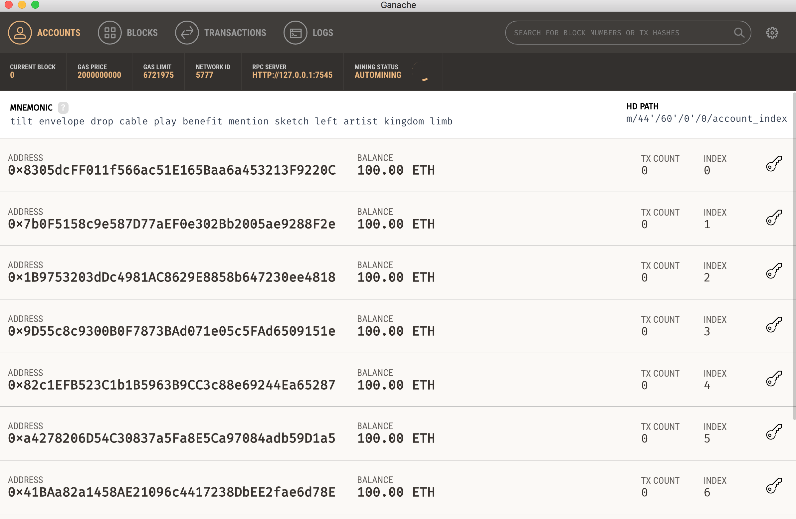

# Solidity contract with Truffle

>**Note** These steps follow and inspired from the Truffle pet-shop tutorial [Ethereum Pet Shop -- Your First Dapp Cloud](https://truffleframework.com/tutorials/pet-shop)

This guide will provide steps to install truffle and ganache, setup truffle to compile and use ethereum accounts from ganache and walk through LoyaltyPoints.sol contract to check desired outcome.

### Install Truffle

We can install Truffle with one npm command:

```
npm install -g truffle
```

### Install and Explore Ganache

Install [Ganache](https://truffleframework.com/ganache), allows to see the current status of all accounts, including their addresses, private keys, transactions and balances.

<div >
  
</div>


### Get Truffle `pet-shop` for testing

Navigate to the root of this directory create a folder for truffle compilation and running truffle commands.

```
cd loyalty-points-evm-fabric
mkdir truffle-env
cd truffle-env
truffle unbox pet-shop
```
Navigate to the root folder and copy the `LoyaltyPoints.sol` contract into the `contracts/` folder.

```
cp LoyaltyPoints.sol /truffle-env/contracts
```

### Compile and test `LoyaltyPoints.sol`

Navigate to the `truffle-env` folder and compile the sol contract:

```
truffle compile
```

Reset truffle connection with Ganache accounts.  Ensure Ganache is running.
```
truffle migrate --reset
```

Access contract through truffle console:
```
truffle console
```

### Truffle Console Commands

In truffle console:

* view the eth accounts
  ```
  truffle(development)> web3.eth.accounts
  ```
  output:
  ```
  [ '0x8305dcff011f566ac51e165baa6a453213f9220c',
  '0x7b0f5158c9e587d77aef0e302bb2005ae9288f2e',
  '0x1b9753203ddc4981ac8629e8858b647230ee4818',
  '0x9d55c8c9300b0f7873bad071e05c5fad6509151e',
  '0x82c1efb523c1b1b5963b9cc3c88e69244ea65287',
  '0xa4278206d54c30837a5fa8e5ca97084adb59d1a5',
  '0x41baa82a1458ae21096c4417238dbee2fae6d78e',
  '0x97c311afed8bec708f5b7648fe6b10e738516d2b',
  '0x856c62eda1166e8058791bac055017e7d8e1c192',
  '0x098699ccb6a487416b05ce46e13c7c403468f90e' ]
  ```


* deploy the application
  ```
  truffle(development)> LoyaltyPoints.deployed().then(function(instance) { app = instance })
  ```
  output:
  ```
  undefined
  ```

* See the contract address
  ```
  truffle(development)> app.address
  ```
  output:
  ```
  '0x08fa0624ced668bede9b8535a5b44af47753d940'
  ```

* register member with eth.accounts[0], providing account number, first name, last name and email
  ```
  truffle(development)> app.registerMember(111111, "Jerry", "Doe", "jerry@doe.com", { from: web3.eth.accounts[0] })
  ```
  output:
  ```
  { tx: '0xe4d464d5afb1b75c0f2065f07d91a7dbae5b4f91f2beebbffe22e2bfeb070291',
  receipt:
   { transactionHash: '0xe4d464d5afb1b75c0f2065f07d91a7dbae5b4f91f2beebbffe22e2bfeb070291',
     transactionIndex: 0,
     blockHash: '0x01c5ceebe8a3ea410cdaeea49bd4e38593a45c136a4f3cd5fc3e91fb548c205d',
     blockNumber: 5,
     gasUsed: 112213,
     cumulativeGasUsed: 112213,
     contractAddress: null,
     logs: [],
     status: '0x1',
     logsBloom: '0x00000000000000000000000000000000000000000000000000000000000000000000000000000000000000000000000000000000000000000000000000000000000000000000000000000000000000000000000000000000000000000000000000000000000000000000000000000000000000000000000000000000000000000000000000000000000000000000000000000000000000000000000000000000000000000000000000000000000000000000000000000000000000000000000000000000000000000000000000000000000000000000000000000000000000000000000000000000000000000000000000000000000000000000000000000000' },
  logs: [] }
  ```

* view member data
  ```
  truffle(development)> app.members(web3.eth.accounts[0])
  ```
  output:
  ```
  [ BigNumber { s: 1, e: 5, c: [ 111111 ] },
  'Jerry',
  'Doe',
  'jerry@doe.com',
  BigNumber { s: 1, e: 0, c: [ 0 ] } ]
  ```

* to view number use `toNumber()` for the element, after capturing the object as variable
  ```
  truffle(development)> app.members(web3.eth.accounts[0]).then(function(m) { member1 = m; })
  member1[0].toNumber()
  ```
  output:
  ```
  111111
  ```

* register partner with eth.accounts[1], and an id of 100
  ```
  truffle(development)> app.registerPartner(100, "United", { from: web3.eth.accounts[1] })
  ```
  output:
  ```
  { tx: '0xb2d020b898f2199c421169fcdb804452a283a5fad19f5758e10375a7a4f0da8a',
  receipt:
   { transactionHash: '0xb2d020b898f2199c421169fcdb804452a283a5fad19f5758e10375a7a4f0da8a',
     transactionIndex: 0,
     blockHash: '0x247108afdfbcf91b61697083c320014d41565431e629f60f58b0d732c47971d7',
     blockNumber: 6,
     gasUsed: 124585,
     cumulativeGasUsed: 124585,
     contractAddress: null,
     logs: [],
     status: '0x1',
     logsBloom: '0x00000000000000000000000000000000000000000000000000000000000000000000000000000000000000000000000000000000000000000000000000000000000000000000000000000000000000000000000000000000000000000000000000000000000000000000000000000000000000000000000000000000000000000000000000000000000000000000000000000000000000000000000000000000000000000000000000000000000000000000000000000000000000000000000000000000000000000000000000000000000000000000000000000000000000000000000000000000000000000000000000000000000000000000000000000000' },
  logs: [] }
  ```

* view partner data  
  ```
  truffle(development)> app.partners(web3.eth.accounts[1])
  ```
  output:
  ```
  [ BigNumber { s: 1, e: 2, c: [ 100 ] }, 'United' ]
  ```

* ensure partner data stored in our partnersInfo struct
  ```
  truffle(development)> app.partnerInfosLength
  ```
  output:
  ```
  BigNumber { s: 1, e: 0, c: [ 1 ] }
  ```

* check the data stored
  ```
  truffle(development)> app.partnersInfo.call(0)
  ```
  output:
  ```
  [ BigNumber { s: 1, e: 2, c: [ 100 ] }, 'United' ]
  ```

* call earnPoints transaction from member account web3.eth.accounts[0], with number of points as first argument and partner id as second
  ```
  truffle(development)> app.earnPoints(200, 100, { from: web3.eth.accounts[0] })
  ```
  output:
  ```
  { tx: '0x3c6875d6814d02885de5a7c1a5d43b40e7a3aaecbe645a23196379b23ea8cc11',
  receipt:
   { transactionHash: '0x3c6875d6814d02885de5a7c1a5d43b40e7a3aaecbe645a23196379b23ea8cc11',
     transactionIndex: 0,
     blockHash: '0x1fc30a1802d2da815e08136bb373ef19108f9c8bfe3b962077b723e624dc3f38',
     blockNumber: 8,
     gasUsed: 128567,
     cumulativeGasUsed: 128567,
     contractAddress: null,
     logs: [],
     status: '0x1',
     logsBloom: '0x00000000000000000000000000000000000000000000000000000000000000000000000000000000000000000000000000000000000000000000000000000000000000000000000000000000000000000000000000000000000000000000000000000000000000000000000000000000000000000000000000000000000000000000000000000000000000000000000000000000000000000000000000000000000000000000000000000000000000000000000000000000000000000000000000000000000000000000000000000000000000000000000000000000000000000000000000000000000000000000000000000000000000000000000000000000' },
  logs: [] }
  ```

* check updated member web3.eth.accounts[0] account
  ```
  truffle(development)> app.members(web3.eth.accounts[0])
  ```
  output:
  ```
  [ BigNumber { s: 1, e: 5, c: [ 111111 ] },
  'Jerry',
  'Doe',
  'jerry@doe.com',
  BigNumber { s: 1, e: 2, c: [ 200 ] } ]
  ```

* call usePoints transaction from member account web3.eth.accounts[0], with number of points as first argument and partner id as second
  ```
  truffle(development)> app.usePoints(50, 100, { from: web3.eth.accounts[0] })
  ```
  output:
  ```
  { tx: '0xaeed684a62c435d048d2c84d0a045e410537b9ce3b555a8ecccdaf7fcb6cadd7',
  receipt:
   { transactionHash: '0xaeed684a62c435d048d2c84d0a045e410537b9ce3b555a8ecccdaf7fcb6cadd7',
     transactionIndex: 0,
     blockHash: '0x42f96dd1ebb9d86db1cbcfe9c8c64e6ca68420ef672fc089b6d24c77e9629c5a',
     blockNumber: 9,
     gasUsed: 98457,
     cumulativeGasUsed: 98457,
     contractAddress: null,
     logs: [],
     status: '0x1',
     logsBloom: '0x00000000000000000000000000000000000000000000000000000000000000000000000000000000000000000000000000000000000000000000000000000000000000000000000000000000000000000000000000000000000000000000000000000000000000000000000000000000000000000000000000000000000000000000000000000000000000000000000000000000000000000000000000000000000000000000000000000000000000000000000000000000000000000000000000000000000000000000000000000000000000000000000000000000000000000000000000000000000000000000000000000000000000000000000000000000' },
  logs: [] }
  ```

* check updated member web3.eth.accounts[0] account
  ```
  truffle(development)> app.members(web3.eth.accounts[0])
  ```
  output:
  ```
  [ BigNumber { s: 1, e: 5, c: [ 111111 ] },
  'Jerry',
  'Doe',
  'jerry@doe.com',
  BigNumber { s: 1, e: 2, c: [ 150 ] } ]
  ```

* check number of transactions stored
  ```
  truffle(development)> app.transactionsLength()
  ```
  output:
  ```
  BigNumber { s: 1, e: 0, c: [ 2 ] }
  ```

* retrieve the first transaction stored
  ```
  truffle(development)> app.transactions(0)
  ```
  output:
  ```
  [ BigNumber { s: 1, e: 2, c: [ 200 ] },
  BigNumber { s: 1, e: 0, c: [ 0 ] },
  BigNumber { s: 1, e: 5, c: [ 111111 ] },
  BigNumber { s: 1, e: 2, c: [ 100 ] } ]
  ```

* retrieve the second transaction stored
  ```
  truffle(development)> app.transactions(1)
  ```
  output:
  ```
  [ BigNumber { s: 1, e: 1, c: [ 50 ] },
  BigNumber { s: 1, e: 0, c: [ 1 ] },
  BigNumber { s: 1, e: 5, c: [ 111111 ] },
  BigNumber { s: 1, e: 2, c: [ 100 ] } ]
  ```
