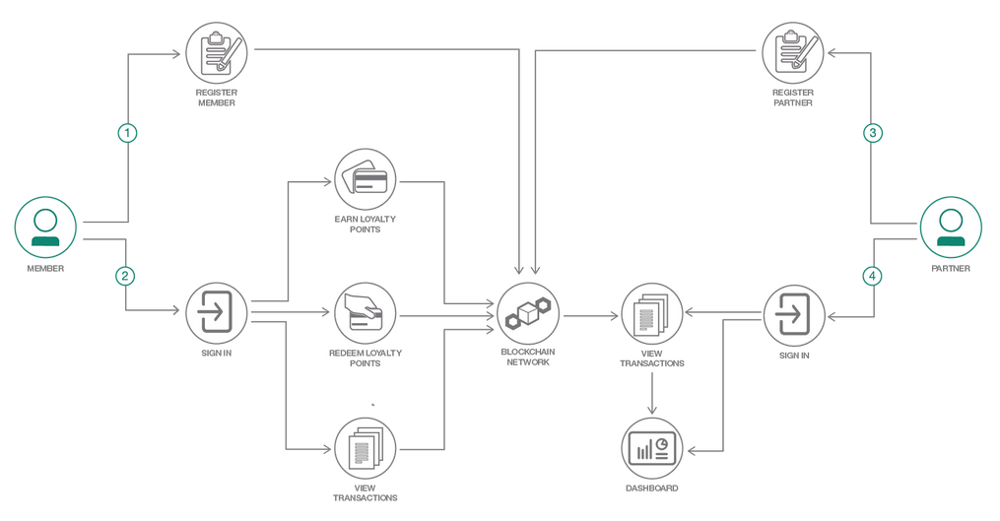

# Customer Loyalty Program use case

>**Note**  This code pattern was inspired from the use case presented in the code pattern [Create a customer loyalty program with blockchain](https://developer.ibm.com/code/patterns/customer-loyalty-program-with-blockchain/) for Hyperledger Composer.

A customer loyalty program allows companies to reward customers who frequently make purchases. Program members are able to earn points on purchases, which can translate into some type of reward such as discount, freebie or special customer treatment. The members work toward a certain amount of points to redeem their reward. These programs can have multiple companies as partners on the program, to cater to a customer base. However, current loyalty program systems are restraint on relations between partners, and with visibility to members. These restraints can be removed by creating the customer loyalty program on a blockchain network.

This blockchain model for a customer loyalty program enhances the value of points to loyalty program members and brings in new value to the partners by creating trusted transactions. Participants in this network have a more level relation among each other and points are in the centric position to connect all participants.

  

