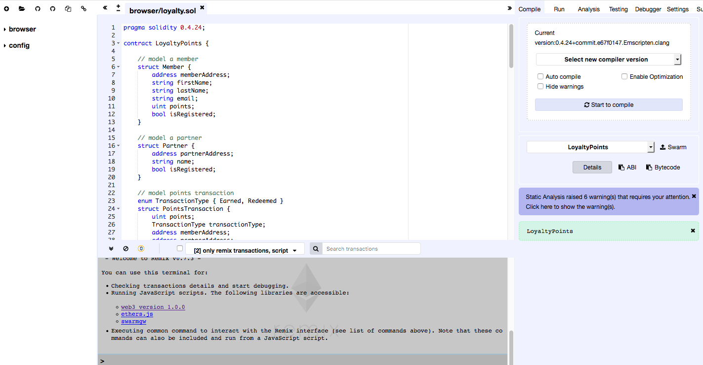
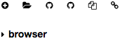
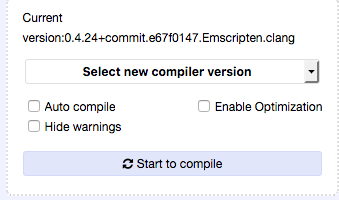
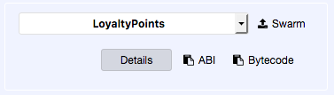

# Using remix to get ABI and bytecode

We can use [remix](http://remix.ethereum.org) to get the contract byte code and ABI.

* Go to the [remix](http://remix.ethereum.org) site

  

* Create a new contract `LoyaltyPoints.sol` by clicking the icon in the top left.

  

* Paste the contract from this repo into the editor

* Choose the compiler of version `0.4.24`, and click on `Start to compile`.

  

* After succesfull compilate, you can get the contract ABI by clicking the `ABI` icon next to the `Details` button.  You should see a pop up at bottom of notifying of the copy to clipboard.

  

* Similarly, you can get the Bytecode by clicking the `Bytecode` icon.  Here, it captures the json with the byte code in the "object" key
